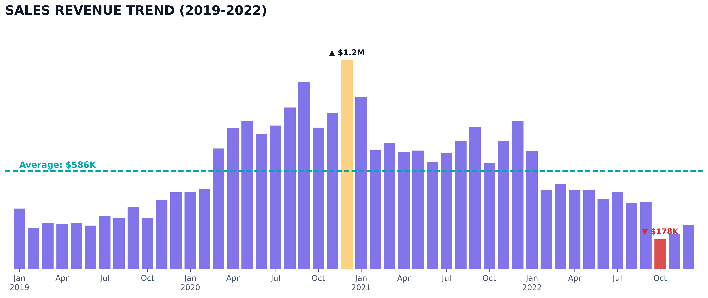
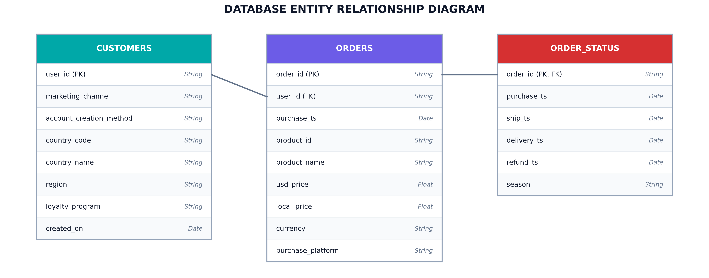
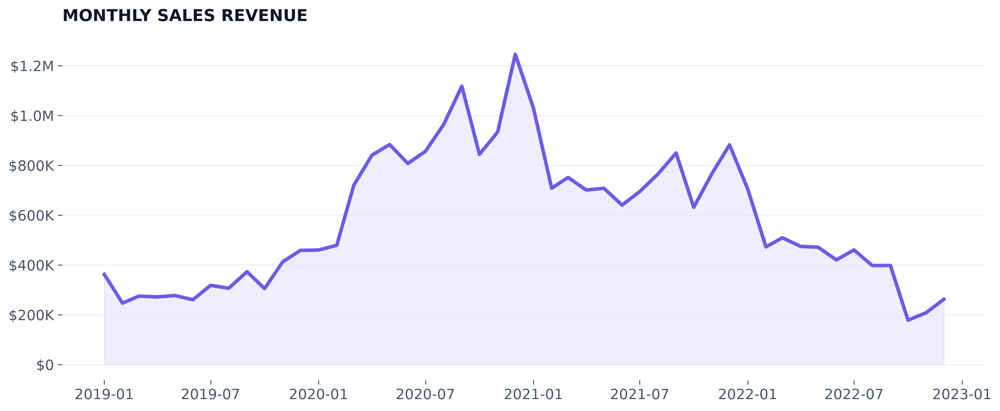
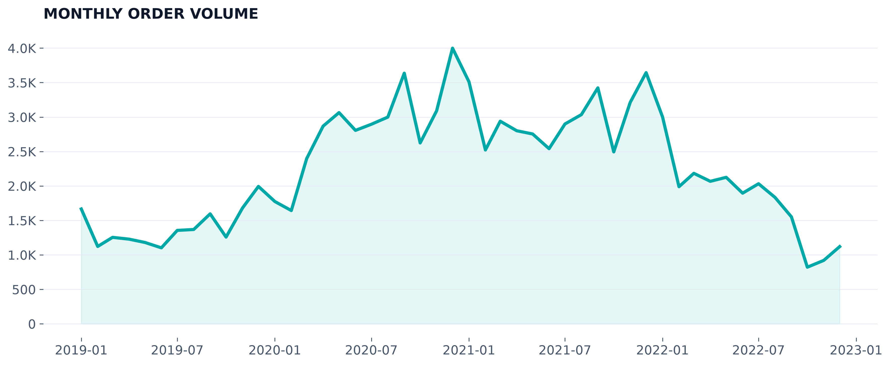
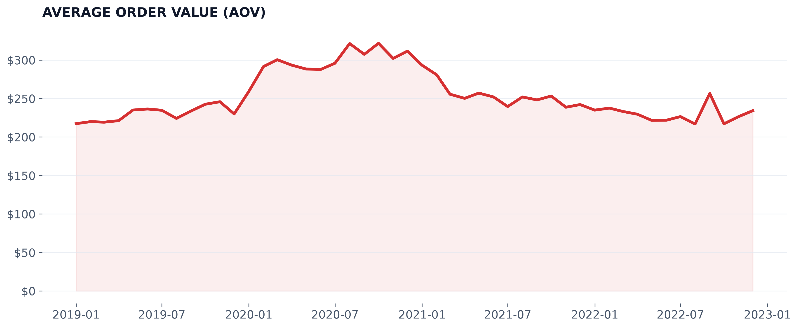
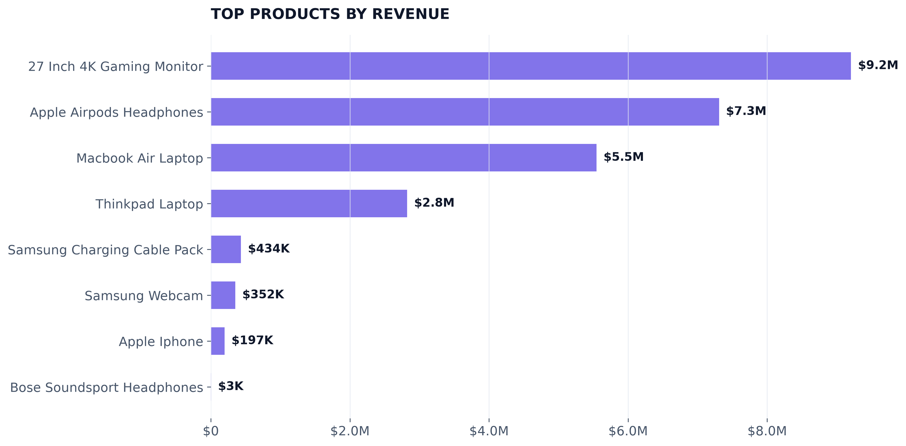
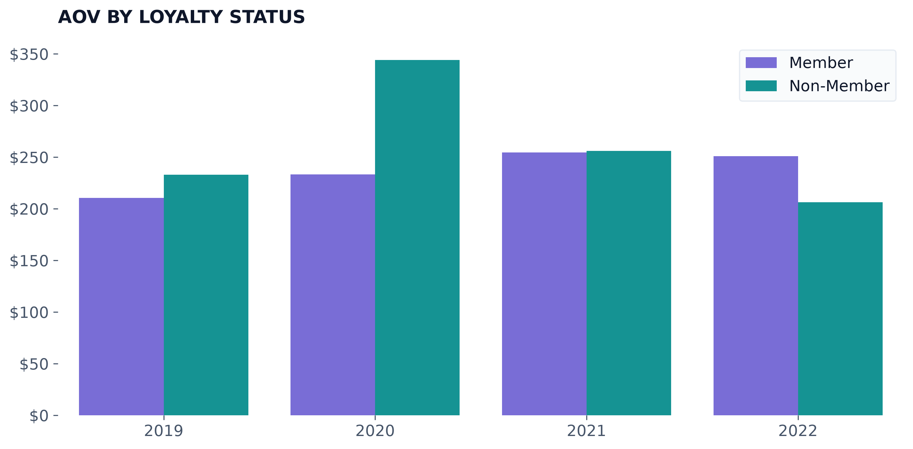
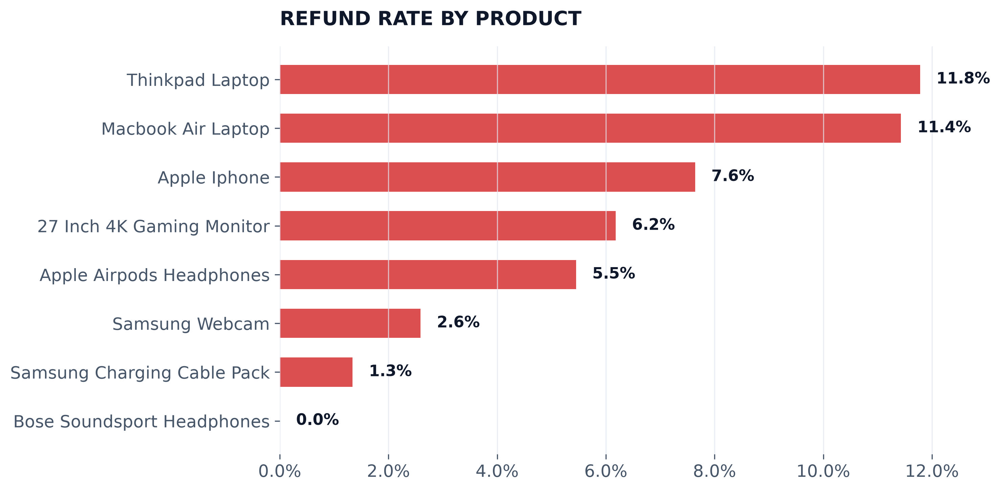
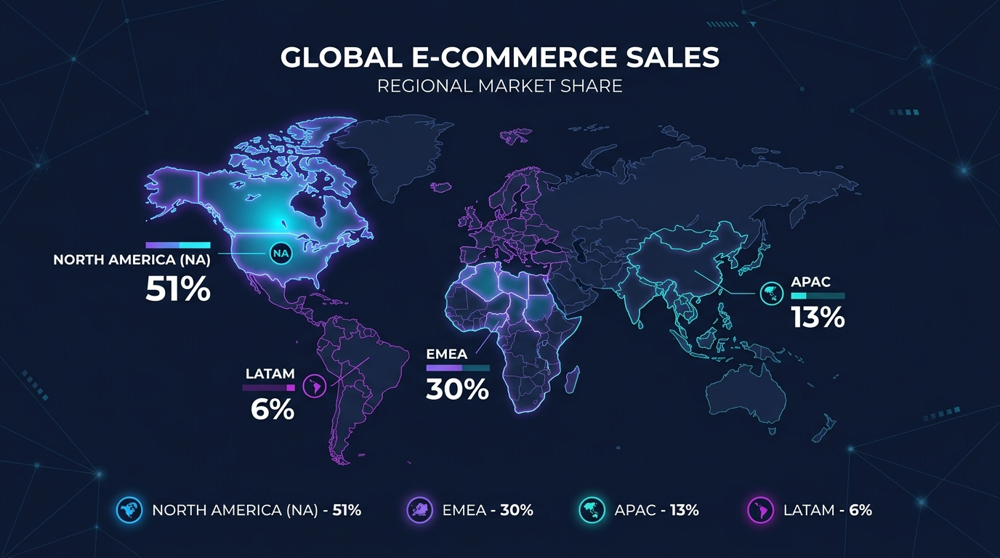

  

<h1 align="center">JarvaTech E-Commerce Performance & Operational Analysis</h1>
<table align="center">
  <tr>
    <td width="1440">
      <h2 align="center">Client Background</h2>
      <body>
        <strong>JarvaTech</strong> operates as a prominent US-based online retailer specializing in consumer electronics and tech accessories. Serving a diverse international market, the brand expanded rapidly following its launch. The business has successfully managed shifts in online purchasing behavior during the pandemic, alongside navigating high market competition and changing macroeconomic conditions.  
         
        Currently, <strong>JarvaTech's</strong> database reflects active relationships with approximately <strong>87,500</strong> customers and records over <strong>107,900</strong> transactions, yielding more than <strong>$28.1 million</strong> in total gross sales. The analytical dataset covers customer engagement channels, detailed product category metrics, loyalty program performance, and regional sales distribution.  
         This operational review, prepared for the Sales Director, examines <strong>JarvaTech's</strong> commercial results spanning 2019 to 2022. The objective is to identify key operational insights, diagnose performance anomalies, and provide strategic recommendations to support business growth and improve customer retention. This analysis focuses on several core areas:
      </body>
      <h3>Northstar Metrics</h3>
      <h4>
        <ul>
          <li><strong>Sales Performance:</strong> Monitoring and evaluating monthly revenue, transaction frequency, and Average Order Value (AOV).</li>
          <li><strong>Product Catalog Health:</strong> Identifying primary revenue drivers, evaluating demand stability, and assessing return frequencies.</li>
          <li><strong>Loyalty Engagement:</strong> Assessing the performance of the customer loyalty program and its impact on transaction sizes and repeat purchases.</li>
          <li><strong>Regional Demand Structure:</strong> Mapping sales concentration across international markets to identify expansion and optimization opportunities.</li>
        </ul>
      </h4>
    </td>
  </tr>
</table>

<table align="center">
  <tr>
    

      <h1 align="center">Executive Summary</h1>
      <h3 align="center">Sales Revenue Analysis (2019–2022)</h3>
      

        
      

      

        <ol>
          <li>
            <strong>Pandemic Acceleration and Peak Performance:</strong>
            <ul>
              <li>Sales experienced a substantial increase in 2020, driven by the shift toward home office equipment and remote learning.</li>
              <li>Revenue peaked in Q4 2020, highlighted by December 2020 reaching approximately $1.25M in monthly sales.</li>
              <li>Strong sales continued into early 2021, with January recording $1.03M, before stabilizing at a lower baseline.</li>
            </ul>
          </li>
          <li>
            <strong>Operational Correction in 2022:</strong>
            <ul>
              <li>The business experienced a notable contraction in 2022, with annual sales declining to $4.96M.</li>
              <li>Q4 2022 recorded historically low seasonal performance, with monthly sales in October ($178K), November ($208K), and December ($262K) reflecting a severe holiday season drop.</li>
              <li>This downward trend requires close operational investigation regarding customer retention and shifting consumer spending habits.</li>
            </ul>
          </li>
          <li>
            <strong>Quarterly Insights & Seasonality:</strong>
            <ul>
              <li>Historically, Q3 and Q4 have represented the highest performing quarter of the year, supported by holiday promotional cycles.</li>
              <li>Conversely, Q1 and Q2 show lower transaction volumes, which highlights the need for targeted promotional strategies during slower quarters.</li>
            </ul>
          </li>
          <li>
            <strong>Core Strategic Focus:</strong>
            <ul>
              <li>The primary challenge in 2022 was transaction volume, as customer purchasing frequency dropped significantly while overall AOV remained relatively stable.</li>
              <li>Strategic focus for 2023 must prioritize customer acquisition, targeted marketing campaigns for lapsed cohorts, and wider adoption of the high-value loyalty program.</li>
            </ul>
          </li>
        </ol>
      

    

  </tr>
</table>

<h2 align="center">Dataset Structure and ERD (Entity Relationship Diagram)</h2>
<body>The database is organized into three main normalized tables: CUSTOMERS, ORDERS, and ORDER_STATUS. Total transactional volume exceeds 108,000 records. All calculations and charts utilize this validated dataset.</body>

  

<h1 align="center">Insights Deep-Dive</h1>

<table align="center">
  <tr>
    <h1 align="center">Sales Revenue</h1>
    

      
    

  </tr>
  <tr>
    <td>
      <ol>
        <li><strong>Sharp Decline in Q4 2022 – A Major Sales Anomaly:</strong>
          <ul>
            <li>Q4 has historically been JarvaTech's strongest performing period due to seasonal consumer spending. However, Q4 2022 experienced a major drop, with December sales falling to $262K. This represents a significant contraction compared to $1.25M in December 2020 and $882K in December 2021.</li>
          </ul>
        </li>
        <li><strong>Post-Pandemic Sales Normalization:</strong>
          <ul>
            <li>Following the explosive 163% growth in 2020 ($10.15M total), annual revenue remained relatively stable in 2021 at $9.13M.</li>
            <li>The drop to $4.96M in 2022 reflects a post-pandemic demand correction, indicating the need to investigate shifts in marketing performance, macro factors, and competition.</li>
          </ul>
        </li>
        <li><strong>Declining Trend Throughout 2022:</strong>
          <ul>
            <li>Revenue showed a persistent downward trend across every quarter of 2022. While the year started relatively well with January at $704K, sales dropped below $500K in February and hit historical lows in Q4, indicating critical customer acquisition and engagement issues.</li>
          </ul>
        </li>
      </ol>
    </td>
  </tr>
</table>

<table align="center">
  <tr>
    <h1 align="center">Number of Orders</h1>
    

      
    

  </tr>
  <tr>
    <td>
      <ol>
        <li><strong>Volume-Driven Revenue Drop:</strong>
          <ul>
            <li>The transactional database shows a severe drop in order count, with annual orders falling from 35,775 in 2021 to 21,538 in 2022. This represents a <strong>39.8% YoY decline</strong> in order volume.</li>
            <li>In comparison, JarvaTech processed 16,801 orders in 2019 and 33,795 orders during the 2020 pandemic surge, showing that the 2022 crash has dropped transaction volumes back near pre-pandemic baselines.</li>
          </ul>
        </li>
        <li><strong>Progressive Monthly Decay:</strong>
          <ul>
            <li>Monthly order volume was highly stable in 2021, consistently staying above 2,500 transactions. However, in 2022, order counts decayed rapidly. Transactions dropped below 2,000 in February (1,989 orders), continued a steady descent through Q3, and collapsed to a historical low of <strong>821 orders in October 2022</strong>.</li>
            <li>Although Q4 holidays provided a slight bump (920 orders in November, 1,120 orders in December), this minor seasonal recovery was far below the 3,644 orders processed in December 2021.</li>
          </ul>
        </li>
        <li><strong>Order Count and Revenue Correlation:</strong>
          <ul>
            <li>The data shows a near 1:1 correlation between total revenue and transaction counts. This suggests that the sales contraction in 2022 is fundamentally a volume issue (customer checkout frequency) rather than average spend characteristics. Recovering transaction velocity is therefore the key commercial priority.</li>
          </ul>
        </li>
      </ol>
    </td>
  </tr>
</table>

<table align="center">
  <tr>
    <h1 align="center">Average Order Value (AOV)</h1>
    

      
    

  </tr>
  <tr>
    <td>
      <ol>
        <li><strong>AOV Surge and Stabilization:</strong>
          <ul>
            <li>Average Order Value peaked during the 2020 pandemic demand wave at $300.43, up from $230.19 in 2019.</li>
            <li>Following this peak, AOV adjusted to $255.15 in 2021, and normalized to $230.18 in 2022, returning precisely to the pre-pandemic baseline. This represents a <strong>23.4% correction</strong> from the 2020 peak.</li>
          </ul>
        </li>
        <li><strong>Monthly Volatility:</strong>
          <ul>
            <li>Throughout 2022, monthly AOV fluctuated between a low of $216 in October and a peak of $256 in September. In contrast, 2020 AOV was consistently elevated, peaking at $322 in October 2020.</li>
            <li>This volatility indicates that while purchase frequency fell, customers continued to buy premium SKUs when they did transact, leading to highly variable average ticket sizes.</li>
          </ul>
        </li>
        <li><strong>Resilience of Brand Value:</strong>
          <ul>
            <li>The relative stability of AOV between 2019 and 2022 shows that average spend per order has remained consistent, confirming that the decline in annual revenue is driven by a drop in total orders rather than pricing pressure or heavy discounting. AOV is not the primary factor in the 2022 revenue decline.</li>
          </ul>
        </li>
      </ol>
    </td>
  </tr>
</table>

<table align="center">
  <tr>
     <h1 align="center">Product Performance</h1>
      

        <h3>Product Revenue Share</h3>
        
      

    <tr>
  </tr>
</table>

<table align="center">
  <tr>
      <td width="500" valign="top">
      <h3>The Best Performers</h3>
      <ul>
        <li>The <strong>27 Inch 4K Gaming Monitor</strong> serves as the primary revenue driver, contributing $9.21M over the analyzed period.</li>
        <li>The <strong>Apple AirPods Headphones</strong> ($7.31M) and <strong>MacBook Air Laptop</strong> ($5.55M) rank as the second and third highest revenue generators, respectively.</li>
        <li>These top three products represent <strong>78.5%</strong> of JarvaTech's total lifetime sales revenue.</li>
      </ul>
      </td>
      <td width="500" valign="top">
      <h3>The Worst Performers</h3>
      <ul>
        <li>The <strong>Bose SoundSport Headphones</strong> generated the lowest revenue, accounting for only $3,339 in lifetime sales, with no sales recorded in multiple months.</li>
        <li>The <strong>Apple iPhone</strong> also underperformed compared to other core electronics, bringing in just $197K in sales.</li>
        <li><strong>Samsung Charging Cables</strong> maintain high transaction volumes but contribute minor top-line revenue due to their low price points.</li>
      </ul>
      </td>
  </tr>
</table>

<table align="center">
  <tr>
    <td width="1000">
      <h3>Detailed Product Observations</h3>
      <ul>
        <li><strong>MacBook Air Sales Divergence:</strong> The MacBook Air laptop ranks third in overall sales revenue ($5.55M, or 19.7% of revenue) but accounts for only <strong>3.67%</strong> of total purchase orders (3,956 orders). This reflects its high AOV contribution, showing it drives significant revenue despite low sales frequency.</li>
        <li><strong>Bose Product Cycle Gaps:</strong> Bose SoundSport Headphones showed multiple months with zero transaction volume, indicating either severe supply chain gaps or a complete lack of marketing push.</li>
      </ul>
    </td>
  </tr>
</table>

<table align="center">
  <tr>
    <h1 align="center">Loyalty Program Learnings</h1>
    <table align="center">
    <tr align="center">
      <td width="1000">
      <h3>Average Order Value by Loyalty Status</h3>
      
    </td>
  </tr>
</table>
    <table>
      <tr>
        <td>
          <ul>
            <li><strong>Sustained Member AOV Growth:</strong> Loyalty program members have maintained positive AOV growth in the post-pandemic correction, with member AOV increasing 19.5% from $210 in 2019 to $251 in 2022. Non-loyalty member AOV fell from $233 in 2019 to $206 in 2022 (an 11.6% decline).</li>
            <li><strong>Higher Average Spend:</strong> In 2022, loyalty members spent an average of $250.94 per order, compared to non-members who averaged $206.14 (a $44.80 spend premium).</li>
            <li><strong>Growing Transaction Share:</strong> Loyalty program orders grew from 12.2% in 2019 (2,052 orders) to <strong>53.7%</strong> of total transactions in 2022 (11,557 orders), serving as a crucial buffer against market contraction.</li>
          </ul>
        </td>
      </tr>
    </table>
  </tr>
</table>

<table align="center">
  <h1 align="center">Refund Rates</h1>
  <tr>
    <td width="500">
       

      <h3>Refund Rate per Product Type</h3>
      
    

    </td>
    <td valign="top" width="500">
      <ul>
        <li><strong>High Return Categories:</strong> Premium laptops show the highest return rates. The <strong>ThinkPad Laptop</strong> has a refund rate of <strong>11.78%</strong>, and the <strong>MacBook Air Laptop</strong> has a refund rate of <strong>11.43%</strong>. These represent JarvaTech's most expensive products, creating significant reverse-logistics costs.</li>
        <li><strong>Low Return Categories:</strong> The least returned product is the Bose SoundSport Headphones, with a return rate of 0.0%, followed by the Samsung Charging Cable Pack with a return rate of 1.34%. However, the Bose headphones are the least frequently purchased product, and the Samsung Charging Cable Pack ranks in the bottom half of overall orders.</li>
        <li><strong>2022 Performance Note:</strong> For the fiscal year 2022, there were no recorded returns in the dataset for any product.</li>
      </ul>
    </td>
  </tr>
</table>

<table align="center">
  <h1 align="center">Regional Results</h1>
      

        
      

  <tr valign="top">
     <td width="900">
      <ul>
        <li><strong>North America (NA):</strong> Represents the primary sales territory, accounting for <strong>51.4%</strong> of global revenue ($13.29M total). The US market alone generated $12.17M of this total.</li>
        <li><strong>EMEA:</strong> Forms the second-largest region at <strong>29.6%</strong> of global revenue ($7.65M), driven mainly by the UK and Germany.</li>
        <li><strong>APAC:</strong> Contributes <strong>13.0%</strong> ($3.37M), showing solid presence but significant room for growth.</li>
        <li><strong>Latin America (LATAM) Underperformance:</strong> Sales have underperformed in the Latin American region, contributing only <strong>6.0%</strong> of total sales ($1.55M), despite its geographical proximity to the primary North American market.</li>
      </ul>
    </td>
  </tr>
</table>

<table align="center">
  <h1>Recommendations</h1>
  <h4>Based on the uncovered insights, here are actionable items that can take away from our analysis:</h4>
  <ul>
    <h3>Sales</h3>
    <li><strong>Stabilize Q1/Q2 Seasonal Demands:</strong> Deploy targeted promotional strategies during Q1 and Q2 to counteract the historical sales drops observed after the holiday season, such as the drop below $500K in February 2022.</li>
    <li><strong>Implement Lapsed Customer Win-Back Campaigns:</strong> Focus marketing efforts on re-engaging customers from the 2020 pandemic cohort, addressing the 39.8% decline in transaction volume (down to 21,538 orders in 2022) while protecting our stable AOV baseline.</li>
    <h3>Products</h3>
    <li><strong>Secure Inventory for Core SKUs:</strong> Maintain stable supply chain lines and buffer stock for the 27-Inch Gaming Monitor, AirPods, and MacBook Air, as these three products generate 78.5% of total sales revenue ($22.06M total).</li>
    <li><strong>Investigate MacBook Air Sales Funnel:</strong> Analyze the checkout funnel for the MacBook Air laptop to understand why it ranks third in overall revenue ($5.55M) but represents only 3.67% of total orders.</li>
    <li><strong>Deprioritize Low-Performing Inventory:</strong> Reduce marketing spend and inventory commitments for Bose SoundSport Headphones, which generated only $3,339 in lifetime sales with multiple months of zero order activity.</li>
    <h3>Loyalty Program</h3>
    <li><strong>Expand Loyalty Conversions Post-Purchase:</strong> Reallocate marketing resources to target non-members immediately post-purchase. This campaign should leverage the substantial $44.80 average spend premium observed in 2022, where members spent $250.94 per order compared to non-members at $206.14.</li>
    <li><strong>Target Loyalty Members for High-Value Laptop Upgrades:</strong> Offer targeted incentives, exclusive financing, or bundle deals for loyalty members to purchase premium hardware like the MacBook Air. Loyalty members are the ideal target persona for these high-ticket electronics, as they consistently purchase higher-priced products, show higher repeat checkout frequency, and exhibit extremely low refund rates.</li>
    <h3>Refund Rates</h3>
    <li><strong>Optimize High-Value Laptop Quality Control and Delivery:</strong> Partner with logistics and shipping providers to audit the delivery path for premium laptops to address the high refund rates on the ThinkPad (11.78%) and MacBook Air (11.43%). Improving the physical safety of shipments and providing post-purchase hardware setup support will help protect margins on these high-ticket items.</li>
    <li><strong>Evaluate Return Policies Based on 2022 Performance:</strong> Investigate the operational factors that led to the anomaly of zero recorded returns in 2022. Compare this with previous years to determine if it was driven by changes in return policy windows, database tracking errors, or genuine improvements in customer satisfaction.</li>
    <h3>Regions</h3>
    <li><strong>Expand Localized Support and Offerings in LATAM:</strong> Implement localized payment options (such as local credit cards and popular regional payment gateways) and localized language support in Latin America. LATAM currently contributes only 6.0% ($1.55M) of lifetime revenue despite its close geographical proximity to the primary North American market (51.4% share), representing a major underutilized market.</li>
    <li><strong>Strengthen APAC Regional Distribution:</strong> Partner with regional fulfillment networks in the APAC region to reduce transit times and shipping costs, helping scale our presence beyond the current 13.0% ($3.37M) revenue baseline.</li>
  </ul>
</table>
